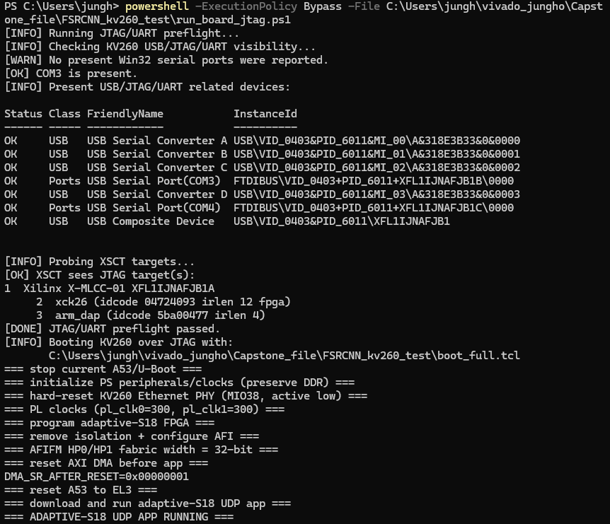

# SCREEN Demo

This repository contains a real-time 4x super-resolution demo running on the AMD Kria KV260.

[View the demo video](./SCREEN_demo.mp4)

## Demo Overview

The KV260 processes a 180 x 320 input video and generates a 720 x 1280 output video in real time.

- **Left:** The original 180 x 320 input, enlarged using simple spatial upscaling only for an easier visual comparison.
- **Right:** The 720 x 1280 upscaled output generated by the KV260.
- **Frame rate:** The recorded demonstration is limited to 60 FPS due to the frame-rate limitation of the camera used for recording.
- **Ethernet link:** At the end of the video, disconnecting the Ethernet cable interrupts the demo, confirming that the real-time data stream is transmitted over Ethernet.

## Runtime Log

The runtime log shown in the demo confirms that the PL is operating at 300 MHz.
